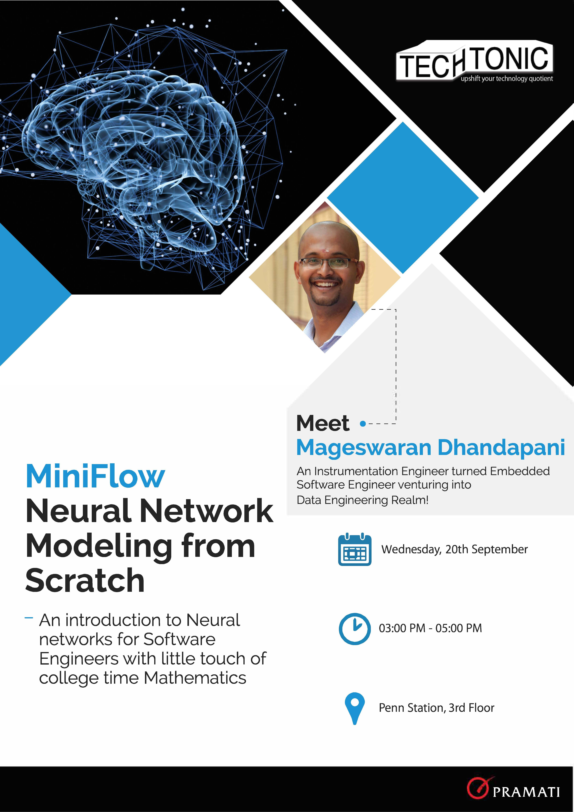

# miniflow
Miniflow - Neural Network Modeling from Scratch that imitate TensorFlow in a way!

## Maths:
- Linear Algebra
- Derivatives
- Partial Derivatives
- Chain Rule

## Algorithms:
- Topological Sort
- Backpropagation
- Gradient Descent

### [Notebook](2017-11-09-MiniFlow.ipynb)
### [Code](MiniFlow.py)

